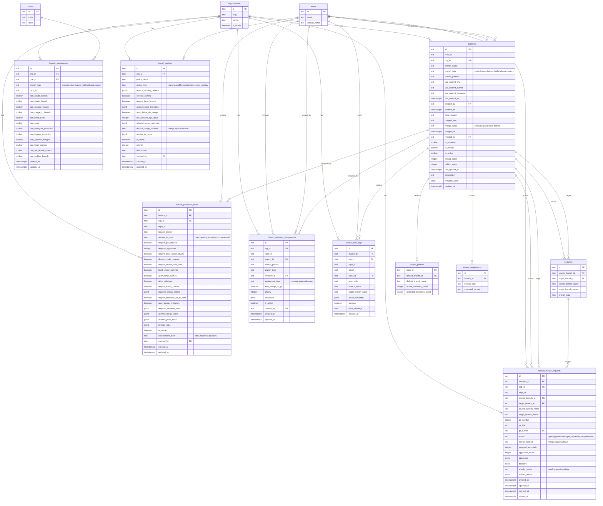
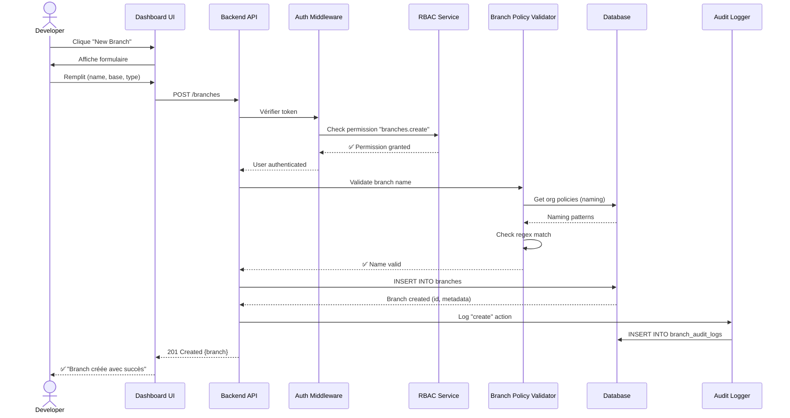
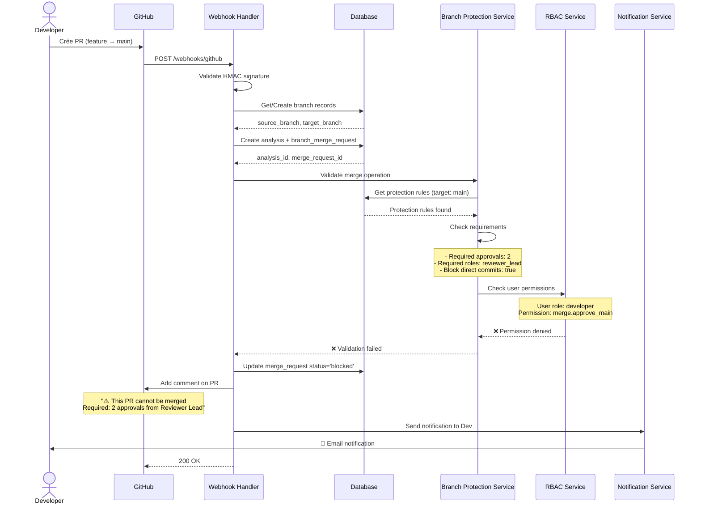
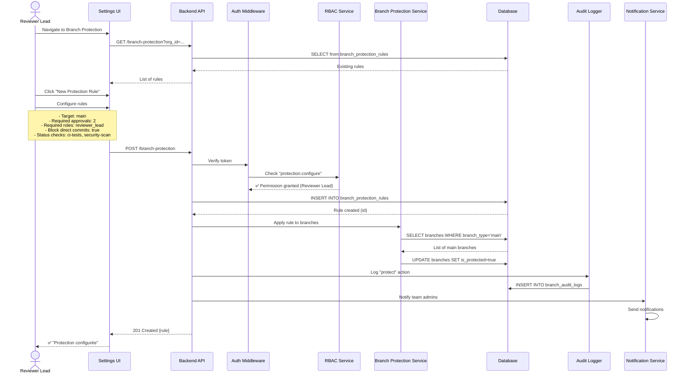
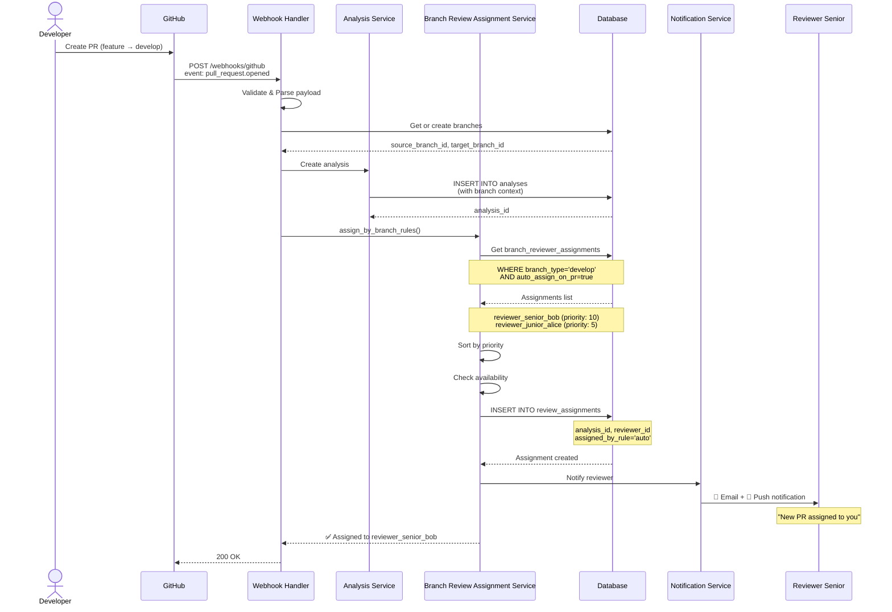
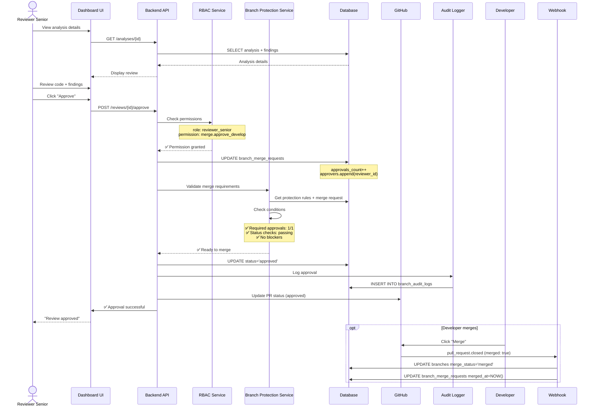
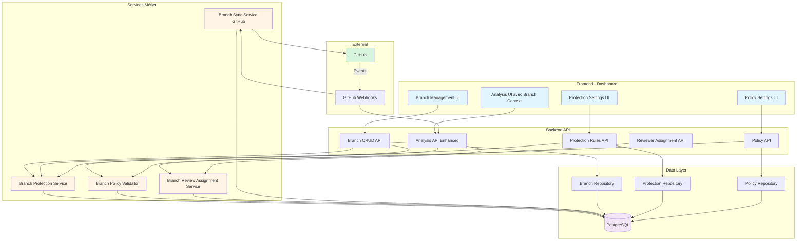
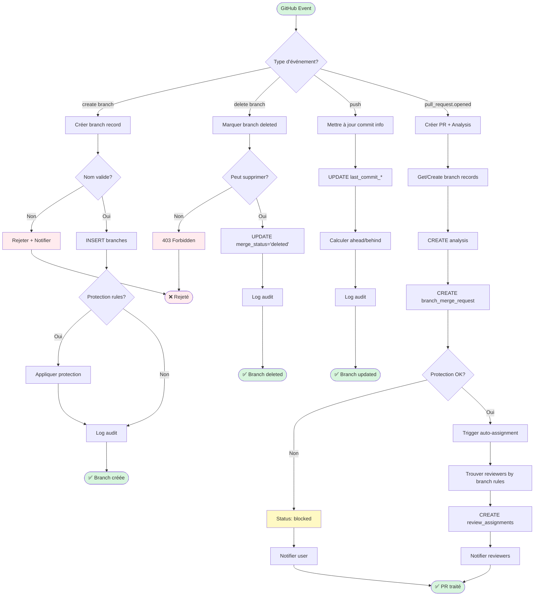

# Schémas Visuels - Système de Gestion des Branches

Ce document contient les diagrammes visuels pour le système de gestion des branches.

## 1. ERD (Entity Relationship Diagram)

## 2. Diagramme de Séquence : Créer Feature Branch

## 3. Diagramme de Séquence : Merge vers Main (Rejeté)

## 4. Diagramme de Séquence : Configurer Protection pour Main

## 5. Diagramme de Séquence : PR avec Auto-Assignation

## 6. Diagramme de Séquence : Approuver et Merger

## 7. Architecture Globale du Système

## 8. Flux de Données : Événement GitHub → Système

---

## Notes d'Utilisation

Ces diagrammes peuvent être rendus avec :
- **Mermaid Live Editor** : https://mermaid.live/
- **GitHub** : Les blocs mermaid sont nativement supportés dans les fichiers .md
- **VS Code** : Extension "Markdown Preview Mermaid Support"
- **Documentation tools** : MkDocs, Docusaurus, etc.

## Légende des Couleurs (Diagramme Architecture)

- 🔵 **Bleu clair** : Frontend / UI
- 🟠 **Orange** : Services Métier
- 🟣 **Violet** : Base de données
- 🟢 **Vert** : Services externes (GitHub)
