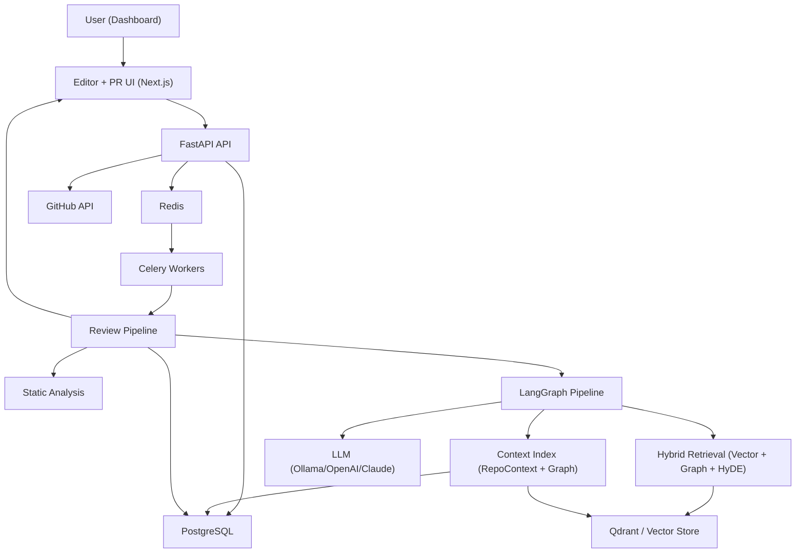
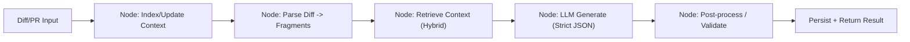

# Systeme De Revue De Code IA + RAG

Guide complet d implementation pour ce projet monorepo.

## 1. Objectif

Construire et operer une plateforme de revue de code:

- editor de code collaboratif temps reel
- integration GitHub reelle (commit/push/branch/PR/review/merge)
- pipeline IA de revue (statique + RAG + LLM)
- execution asynchrone robuste (Celery/Redis)
- contexte repository incremental (GraphRAG)
- sorties traçables, strictes, et auditees

Contraintes:

- ne pas casser les features existantes
- architecture modulaire
- pas de recalcul inutile
- fallback sans LLM
- logs + observabilite obligatoires

## 2. Architecture Globale



## 3. Mapping Au Code Reeel (Ce Repo)

Backend principal:

- `apps/backend/app/api/http/*`
- `apps/backend/app/workers/tasks/analyze_pr.py`
- `apps/backend/app/workers/tasks/langgraph_analysis.py`
- `apps/backend/app/core/analysis/intelligence/langgraph.py`
- `apps/backend/analysis/langGraph/context/*`
- `apps/backend/analysis/langGraph/raggraph/*`
- `apps/backend/analysis/langGraph/pipeline.py`

Frontend dashboard:

- `apps/dashboard/app/dashboard/*`
- `apps/dashboard/components/*`
- `apps/dashboard/app/api/dashboard/*` (proxy server-side)
- `apps/dashboard/lib/github-client.ts`
- `apps/dashboard/lib/server/github/*`

Docs techniques existantes:

- `docs/architecture/architecture.md`
- `docs/guides/repo-context-manual.md`
- `docs/guides/reviewer-system.md`

## 4. Domaines Fonctionnels

### 4.1 Editor + Collaboration

Requis:

- create/rename/delete fichier et dossier
- edition multi-fichiers
- syntax highlighting
- collaboration temps reel

Impl actuelle: composants editor dans `apps/dashboard/components/editor/` et `MonacoEditor.tsx`.

Cible:

- toute operation editor appelle une API backend qui ecrit sur GitHub
- zero mock local-only

### 4.2 GitHub Operations Reelles

Operations obligatoires:

- create/update branch
- create/update/delete file and folders
- commit + push
- create PR
- review comment / approve / request changes
- merge PR

Point d entree frontend:

- `apps/dashboard/lib/github-client.ts`
- `apps/dashboard/lib/server/github/client.ts`
- `apps/dashboard/lib/server/github/auth.ts`

### 4.3 Team Scope + Auth

Requis:

- auth GitHub via Clerk
- operations limitees au contexte team/org
- aucune operation hors scope

Controle:

- middleware dashboard + API route auth
- verification membership org/team avant operation GitHub critique

### 4.4 Review IA (Statique + RAG + LLM)

Pipeline cible:

1. parse diff
2. static analysis (existing)
3. retrieval contexte (hybrid)
4. generation findings LLM (JSON strict)
5. post-process + anti-hallucination
6. merge static + llm output

## 5. Architecture LangGraph Cible



Fichiers:

- `apps/backend/analysis/langGraph/pipeline.py`
- `apps/backend/analysis/langGraph/context/repo_context_manager.py`
- `apps/backend/analysis/langGraph/context/ingestion_service.py`
- `apps/backend/analysis/langGraph/raggraph/hybrid_retriever.py`
- `apps/backend/analysis/langGraph/raggraph/retriever.py`
- `apps/backend/analysis/langGraph/raggraph/llm_orchestrator.py`
- `apps/backend/analysis/langGraph/raggraph/post_processor.py`

## 6. Indexation Repository (GraphRAG)

### 6.1 First Run (full index)

But:

- construire un contexte global initial

Etapes:

1. cloner/acceder au repo
2. parcourir fichiers
3. extraire fonctions/classes/imports/relations
4. construire graph (nodes + edges)
5. chunking + embeddings
6. stocker dans vector store + metadata SQL
7. enregistrer profile + historique

Implementation:

- `context/ingestion_service.py`
- `context/graph_manager.py`
- `context/repo_context_manager.py`

### 6.2 Next Runs (incremental)

But:

- ne pas reindexer tout

Etapes:

1. lire diff git
2. detecter changed_files
3. upsert chunks modifies
4. delete chunks obsoletes
5. refresh graph local sur paths impactes
6. append contexte history

## 7. Retrieval Hybride

Strategie combinee:

- exact/path/symbol match
- lexical search
- semantic vector search (Qdrant)
- graph neighborhood expansion
- HyDE query expansion
- rerank cross-encoder

Sources:

- code legacy
- markdown/doc
- policies
- tickets
- docs externes importees

Fichiers:

- `raggraph/retriever.py`
- `raggraph/hybrid_retriever.py`
- `raggraph/cross_encoder.py`
- `raggraph/hyde.py`

## 8. Prompting + Generation LLM

Requirements:

- role system strict
- include diff + fragments + retrieved context
- output JSON schema strict
- max findings bornes
- citations obligatoires

Fichiers:

- `raggraph/llm_service.py`
- `raggraph/llm_orchestrator.py`
- `raggraph/post_processor.py`

## 9. Post Processing Et Securite

Check list:

- validate JSON schema
- drop invalid findings
- dedupe findings
- filtrer file_path hors changed_files
- confidence threshold
- sanitizer markdown/text
- merge static + llm
- fallback si LLM down

## 10. Async Runtime (Celery + Redis)

Tasks:

- `analysis.run_minimal_pipeline`
- `analysis.run_langgraph_pipeline`

Worker command (Windows):

```bash
poetry run celery -A app.workers.celery_app.celery_app worker --loglevel=info -Q analyses -P solo -c 1
```

### 10.1 Circular import guard

Pour eviter les loops d import:

- prefer lazy export dans `__init__.py`
- eviter imports croises eager entre `context` et `raggraph`
- utiliser local import dans constructeur si dependance lourde

## 11. APIs A Exposer (Contract)

### 11.1 Editor/GitHub

- `POST /api/dashboard/editor/files/create`
- `POST /api/dashboard/editor/files/update`
- `POST /api/dashboard/editor/files/delete`
- `POST /api/dashboard/editor/files/rename`
- `POST /api/dashboard/editor/folders/create`
- `POST /api/dashboard/editor/folders/delete`
- `POST /api/dashboard/editor/folders/rename`

Toutes ces routes:

- auth user + team scope
- operation reelle GitHub
- commit message + actor trace
- retour commit sha + branch

### 11.2 PR Workflow

- `POST /api/dashboard/pulls/create`
- `POST /api/dashboard/pulls/comment`
- `POST /api/dashboard/pulls/review`
- `POST /api/dashboard/pulls/approve`
- `POST /api/dashboard/pulls/request-changes`
- `POST /api/dashboard/pulls/merge`

### 11.3 KB / RAG

- `POST /v1/kb/onboard`
- `POST /v1/kb/update`
- `POST /v1/kb/context/diff`
- `POST /v1/kb/context/query`

## 12. Data Model Minimum

Tables deja utiles ou a consolider:

- analyses
- findings
- tool_runs
- repo_profiles
- repo_context_chunks
- code_entity_edges
- review_outputs

Champs critiques:

- repo_id
- project_id
- org/team scope id
- commit_sha / branch / pr_number
- retrieval_trace
- llm_status / fallback_reason

## 13. Observabilite

Metrics:

- queue lag
- pipeline duration per stage
- retrieval hits by channel
- llm success/fail/fallback rate
- p95 latency per endpoint
- github api error rates

Logs:

- request_id
- analysis_id
- repo_id
- task_id
- actor_id

## 14. Plan D Implementation Par Phases

### Phase 0 - Baseline

- freeze interfaces existantes
- activer tests smoke
- verifier migrations

Done si:

- API + worker + dashboard bootent sans erreur

### Phase 1 - GitHub Client Core

- finaliser service unique GitHub backend
- normaliser erreurs (403/404/rate limit)
- ajouter retry/backoff idempotent

Done si:

- create/update/delete/rename file+folder fonctionne en vrai sur GitHub

### Phase 2 - Editor Realtime

- branch workspace selection
- file tree sync
- save auto + manual
- conflict handling

Done si:

- edition depuis UI ecrit reellement sur repo distant

### Phase 3 - PR Workflow

- create PR
- discussions/comments
- review events
- merge strategy

Done si:

- flux complet PR sans mock

### Phase 4 - LangGraph Context

- full onboarding stable
- incremental update stable
- context history persist

Done si:

- zero full-reindex sur petits diffs

### Phase 5 - Hybrid Retrieval

- vector + graph + hyde + rerank
- filters language/module/date/tags

Done si:

- top-k precision meilleure que baseline

### Phase 6 - LLM Strict Output

- schema strict JSON
- hallucination guard
- source check

Done si:

- erreurs parse < 1%

### Phase 7 - Production Hardening

- fault tolerance Neo4j/Qdrant
- redis cache tuning
- observabilite complete

Done si:

- SLO pipeline respecte

## 15. Checklist Qualite Avant Release

- static analysis intacte (non regresse)
- all editor actions are real GitHub ops
- all PR actions are real GitHub ops
- auth + team scope enforced
- fallback mode returns static + retrieved context
- pipeline idempotent sur retry celery
- import loops tests passes
- docs/runbook a jour

## 16. Runbook Execution Rapide

1. demarrer infra:

```bash
make up
make migrate
```

2. backend host:

```bash
cd apps/backend
poetry run uvicorn app.main:app --reload
```

3. worker:

```bash
cd apps/backend
poetry run celery -A app.workers.celery_app.celery_app worker --loglevel=info -Q analyses -P solo -c 1
```

4. dashboard:

```bash
cd apps/dashboard
npm run dev
```

5. verifier:

- create/edit file depuis dashboard
- commit visible sur GitHub
- PR creation/review/merge
- analysis pipeline complete

## 17. Troubleshooting Rapide

### 17.1 Circular import worker

Symptome:

- `ImportError: partially initialized module ...`

Actions:

- lazy exports dans `analysis/langGraph/context/__init__.py`
- lazy exports dans `analysis/langGraph/raggraph/__init__.py`
- local import de `RepositoryGraphManager` dans `ingestion_service.py`

### 17.2 LLM down

Expected behavior:

- `status=fallback`
- static findings + retrieval context returns

### 17.3 GitHub permission denied

Actions:

- verifier OAuth token
- verifier membership org/team
- verifier scopes repo/pull_request

## 18. Definition Of Done (Projet)

Le systeme est considere pret quand:

- editor + PR workflow = 100% operations GitHub reelles
- pipeline review = stable, async, traceable
- retrieval hybride = actif et pertinent
- fallback = fiable
- tests critiques + runbooks = verts

---

Version: 1.0  
Scope: `ai-code-review-platform`  
Audience: backend/frontend/devops/reviewer

